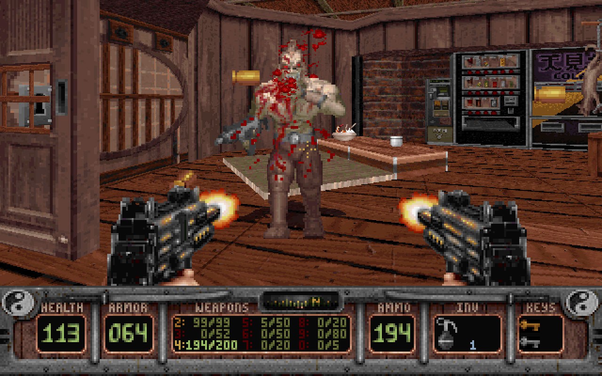
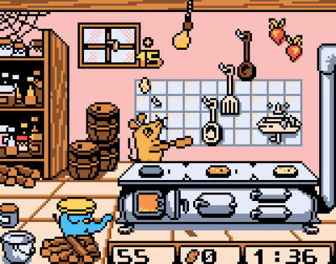
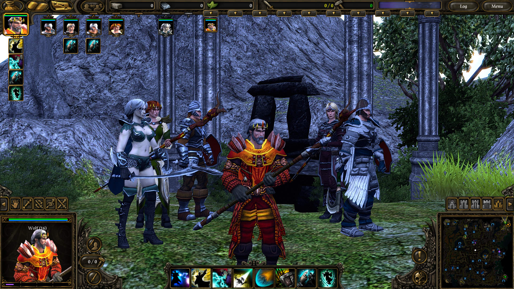
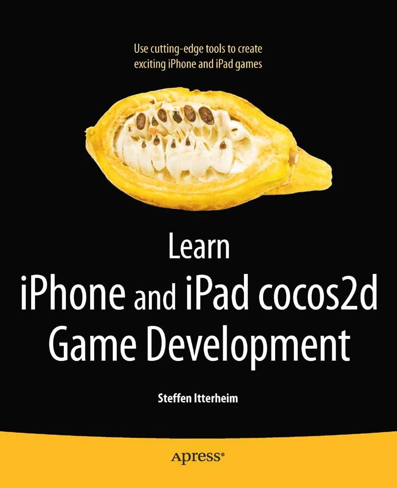
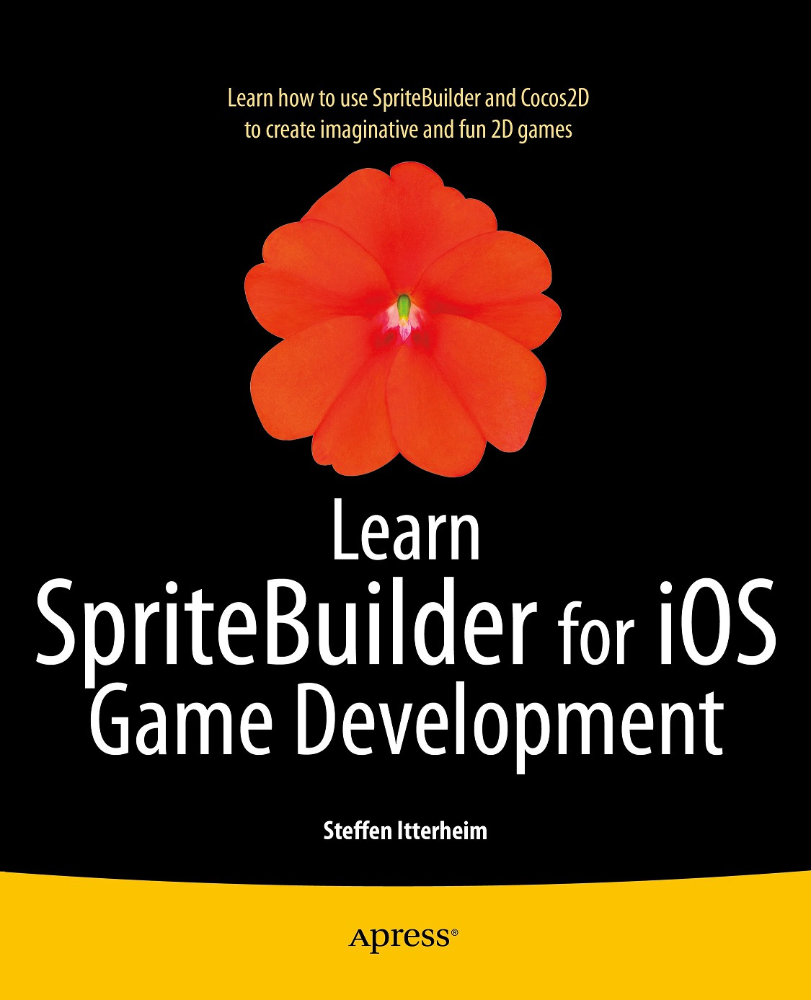
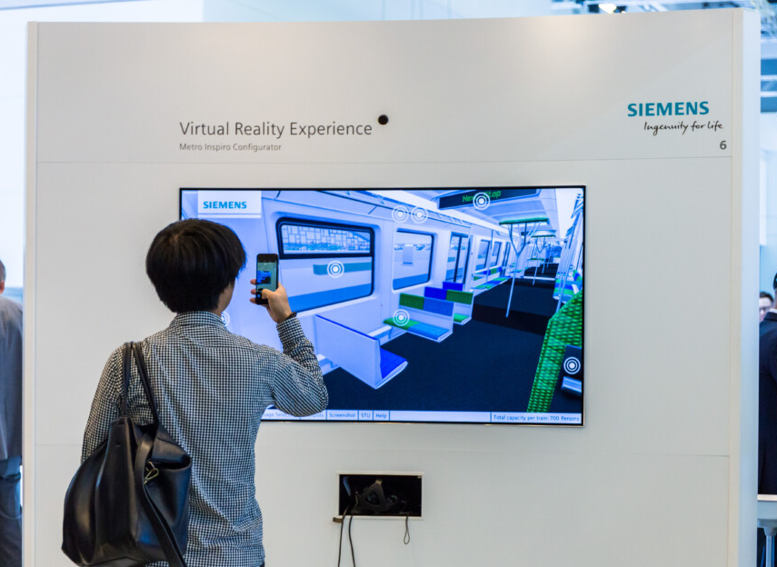
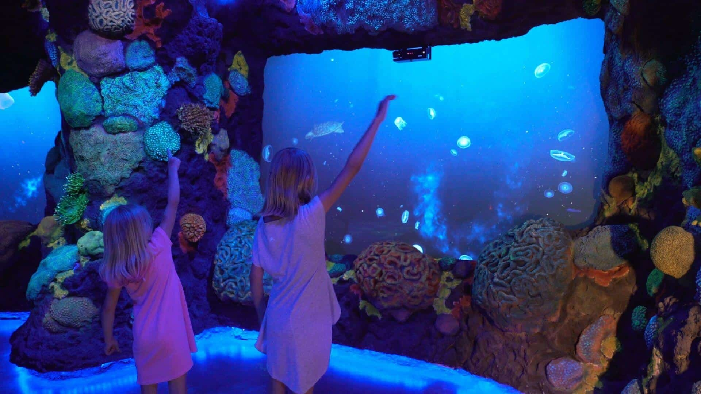

# About the Author

Hi! I'm Steffen from Germany. 

I've been modding and making games since the 1990s. I particularly enjoyed modding with scripting languages (Hexen, Quake). My first paycheck: beta-testing for 3D Realms. Work-Life perfectly balanced: "I'm not playing, mum. I'm working!" :)

Around 2000 I worked as designer on eight GameBoy titles in three years. We used visual statemachines to script entire games. It was super productive and fun.

Then I transferred the statemachines concept to a Lua-based declarative API: command units, script dialogue and cutscenes. Designers loved the power, onboarding was easy. We created three heavily scripted main titles with three add-ons (SpellForce, BattleForge). 

Then I began freelancing for mobile as it exploded. I had fun writing game engine books (Learn cocos2d, Learn SpriteBuilder). 

2015 onwards I stepped into 'digital marketing'. As train buff, I just couldn't resist creating a realtime 3D Train Configurator in Unity for Siemens. It had a Virtual Reality mode with hand gesture interaction.

What followed was an extreme mixture of serial low-budget projects and innovative high-tech entertainment experiences. Mostly Unity, plenty of Lidars and Projectors. 

Since 2022 I've done excessive R&D, prototyping, frameworking. Searching for 'the one' - the project/product combining self-efficacy with self-sufficiency. It led to interesting discoveries...

Finally, I just went ahead and spent months integrating Lua in Unity as alternative language. With Unity's full API exposed.

But .. this meant it was no different from removed UnityScript and UnrealScript: a simpler language alright, but with the engine's full API complexity!

Researching into the history and future of game engines, I came across many beginner tutorials, calls for help, and code snippets - same content, different engines.

Then it struck me.

## The Realization

We teach young game engine "drivers" Volkswagen here, Chrysler there. We caution: "Don't learn driving with a Porsche!"

### This makes no sense! 

[I proclaimed: all engines are created equal!](https://www.reddit.com/r/gamedev/comments/1nmtuqg/every_industrygrade_game_engine_has_the_same_api/) 

The backlash was encouraging. We are so entrenched in „our“ engines and at such a low level, we are ignorant of beginners' challenges. 

Between Scratch and Godot/Unity, there's a lot of learners going back and forth, struggling to make sense of the complexity of pro-tier engines.

### Now I'm convinced: 

We can, should, **MUST** standardize entry-level game engine programming! 

It hurts everyone if beginners get locked into vendor APIs and their conceptual models - they needn't be different in the first place.

In fact, the conceptual differences are superficial: Hierarchical content, lifecycle events, a widely shared set of features. The main differences are only in high-end features and editor UI.

In every team we frequently programmed the same things over and over again. They were too small to abstract and reuse. Too many not to cause friction. Every developer had their own way of doing things.
