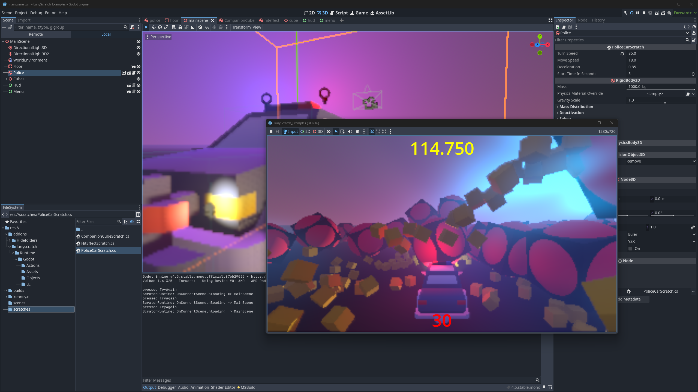
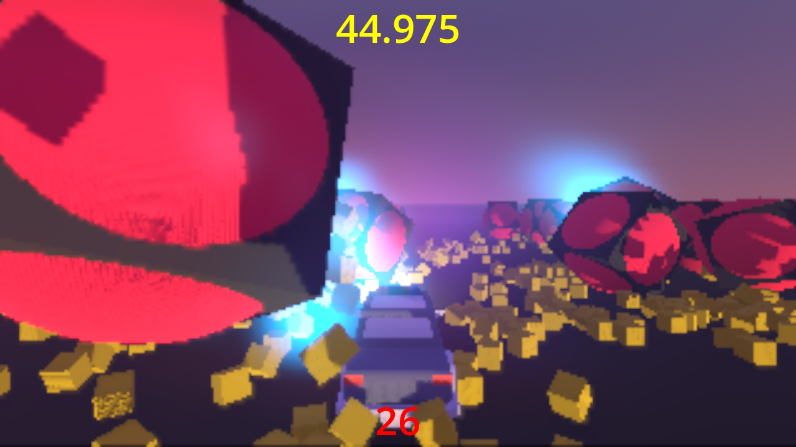

# Proof of Concept Demo (October 2025)

> 🚧 **Historical Archive**: This PoC demonstrates initial feasibility. Not production-ready.

## Overview

A vertical slice from scratch in **under 20 days**: Started with Unity, then ported to Godot and Unreal in 3 days each.

[](https://youtu.be/Vn38VLNDsuw "LunyScript: Same Code, Three Engines - Proof of Concept Demo")

**[Watch the full video on YouTube (1:20)](https://youtu.be/Vn38VLNDsuw)**

---

## 🧐This can't possibly work!!🤥

It does! 

It's really not rocket science: Engines aren't that different. They all make games using the same basic set of high-level features. LunyScript aims to standardize only that high-level functionality. Because these features are so fundamental, they haven't changed at all in years.

I asked a [provocative question on reddit](https://www.reddit.com/r/gamedev/comments/1nmtuqg/every_industrygrade_game_engine_has_the_same_api/) and [a follow-up](https://www.reddit.com/r/gamedev/comments/1nslk03/one_api_to_rule_them_all_them_godot_unity_unreal/) and the responses were uniformly:

- It's impossible ⛔
- Makes no sense 😐
- Nodody needs this 🗑️
- APIs are easy anyway 🙂‍↔️
- It's a massive amount of work 😫
- The point of engines is to be different 🤔

This is called cognitive bias. It's also my fault because I did not explain it as well as I can now. And I talked to the wrong audience, obviously. It's like telling them: "You know, you could have had it way easier all this time." - devaluing their experience.

## So, How Does It Work?

**→ [How LunyScript unifies different engine architectures](../docs/EngineDifferences.md)**<br/>
**→ [API design philosophy and principles](../docs/Philosophy.md)**<br/>
**→ [Code comparison: LunyScript vs Engine scrips](../docs/CodeComparison.md)**<br/>
**→ [More Design details](../docs/index.md)**<br/>
_Note: Physics behaviour will deviate between physics engines, requires scaling values._

---

## What's Implemented

The PoC demonstrates LunyScript orchestrating essential gameplay systems across all three engines:

| System | Features Demonstrated |
|--------|---------------------|
| **Input** | Keyboard input detection |
| **Physics** | Rigidbody movement, forces, velocity control |
| **Collision** | Collision detection events, collision filtering |
| **Assets** | Prefab addressing, instantiation |
| **Scene Graph** | Object create/destroy, find children by name, transform |
| **UI** | Text display, Variable binding, Button press events |
| **Variables** | Game state and progression, timer & score |
| **Audio** | Sound effect playback |

**Scope:** High-level gameplay scripting - orchestrating game logic, behaviors, and interactions. LunyScript is **not** a game engine API replacement.

---

## Screenshots

### Godot



### Unity


### Unreal


---

## Source Code Repositories

| Engine | Repository |
|--------|-----------|
| **Godot** | [LunyScratch_Examples_Godot](https://github.com/CodeSmile-0000011110110111/LunyScratch_Examples_Godot) |
| **Unity** | [LunyScratch_Examples_Unity](https://github.com/CodeSmile-0000011110110111/LunyScratch_Examples_Unity) |
| **Unreal** | [LunyScratch_Examples_Unreal](https://github.com/CodeSmile-0000011110110111/LunyScratch_Examples_Unreal) |

---

## Example: Player Controller Script

This is the script for the "Police Car" which acts as both player controller and overall game state.

⚠️ **Note:** API in this PoC represents an early first draft. Final API will differ in key aspects.

```csharp
using Godot;
using LunyScratch;
using System;
using static LunyScratch.Blocks;
using Key = LunyScratch.Key;

public sealed partial class PoliceCarScratch : ScratchRigidbody3D
{
    [Export] private Single _turnSpeed = 70f;
    [Export] private Single _moveSpeed = 16f;
    [Export] private Single _deceleration = 0.85f;
    [Export] private Int32 _startTimeInSeconds = 5;

    protected override void OnScratchReady()
    {
        var progressVar = GlobalVariables["Progress"];
        var scoreVariable = Variables.Set("Score", 0);
        var timeVariable = Variables.Set("Time", _startTimeInSeconds);

        // Handle UI State
        HUD.BindVariable(scoreVariable);
        HUD.BindVariable(timeVariable);

        Run(HideMenu(), ShowHUD());
        RepeatForever(If(IsKeyJustPressed(Key.Escape), ShowMenu()));

        // must run globally because we Disable() the car and thus all object sequences will stop updating
        Scratch.When(ButtonClicked("TryAgain"), ReloadCurrentScene());
        Scratch.When(ButtonClicked("Quit"), QuitApplication());

        // tick down time, and eventually game over
        RepeatForever(Wait(1), DecrementVariable("Time"),
            If(IsVariableLessOrEqual(timeVariable, 0),
                ShowMenu(), SetCameraTrackingTarget(null), Wait(0.5), DisableComponent()));

        // Use RepeatForeverPhysics for physics-based movement
        var enableBrakeLights = Sequence(Enable("BrakeLight1"), Enable("BrakeLight2"));
        var disableBrakeLights = Sequence(Disable("BrakeLight1"), Disable("BrakeLight2"));
        RepeatForeverPhysics(
            // Forward/Backward movement
            If(IsKeyPressed(Key.W),
                    MoveForward(_moveSpeed), disableBrakeLights)
                .Else(If(IsKeyPressed(Key.S),
                        MoveBackward(_moveSpeed), enableBrakeLights)
                    .Else(SlowDownMoving(_deceleration), disableBrakeLights)
                ),

            // Steering
            If(IsCurrentSpeedGreater(0.1),
                If(IsKeyPressed(Key.A), TurnLeft(_turnSpeed)),
                If(IsKeyPressed(Key.D), TurnRight(_turnSpeed)))
        );

        // add score and time on ball collision
        When(CollisionEnter(tag: "CompanionCube"),
            IncrementVariable("Time"),
            // add 'power of three' times the progress to score
            SetVariable(Variables["temp"], progressVar),
            MultiplyVariable(Variables["temp"], progressVar),
            MultiplyVariable(Variables["temp"], progressVar),
            AddVariable(scoreVariable, Variables["temp"]));

        // blinking signal lights
        RepeatForever(
            Enable("RedLight"),
            Wait(0.16),
            Disable("RedLight"),
            Wait(0.12)
        );
        RepeatForever(
            Disable("BlueLight"),
            Wait(0.13),
            Enable("BlueLight"),
            Wait(0.17)
        );

        // Helpers
        // don't play minicube sound too often
        RepeatForever(DecrementVariable(GlobalVariables["MiniCubeSoundTimeout"]));
        // increment progress (score increment) every so often
        RepeatForever(IncrementVariable(progressVar), Wait(15), PlaySound());
    }
}
```

---

[← Back to Main Documentation](../index.md)
