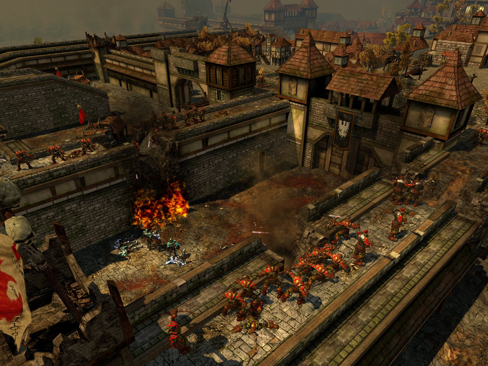
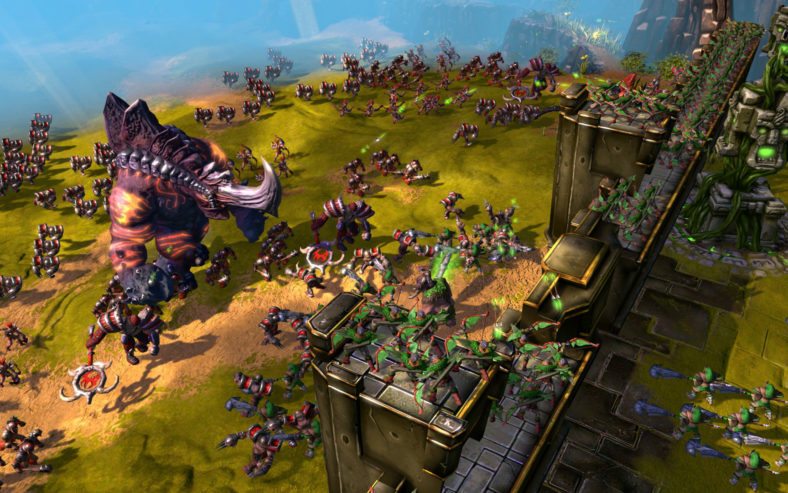

# The "Why?" Behind LunyScript - A Personal Intro

**High-level, text-based programming is efficient and designer-friendly.** It eases beginners into complex programming tasks and introduces them to valuable patterns, as I've learned myself. 

Unfortunately, it's also a lost art.

Well into the 2000s many game studios had the highly valuable role of the **designing-coder** and the **coding-designer**. Both were using the same tool, a scripting language or parsed data descriptions or both. It was simple and intuitive, but also very powerful. 

Because without code, a design is worthless. And without design, code is ineffective.


<sup>SpellForce 2 - Dragon Storm (2007)</sup>

The race towards "higher efficiency" forced the team I worked with to split up into separate entities with specialized roles: the ones who created the flow of gameplay, and the ones who made the environment look consistently good.

From then on, **at the very core of gameplay was a disconnect.**

Two factions viewing each other as foreigners. The artists break the logic. The designers messed up the art. We changed creation from an amalgamation of personal choices towards building a bland product on an assembly line.


<sup>BattleForge (2009)</sup>

This is the state of the game industry at large today. 

Only small teams can afford to break out of assembly productions split by roles. In fact, it's their most important angle to find success. 

But those creative artists, solo developers, beginners, visionaries all struggle to cope with the immense complexity of powerful tools we have at our disposal - just to create very basic gameplay. 

They work with the powerhouse engines who naturally align their features to requirements of corporate productions, bolstering the division of developer roles.

I **know** that the amalgamation of "design as code" works and provides huge benefits.

That's all **I** need to know. Of course **you** want to know more:

# They Became The Problem They Solved!

## 2000s
**Problem:** "We can't port our game from Windows to Mac or Playstation - the APIs are completely different!"

**Solution:** Game engines! Write once, deploy cross-platform.

## 2020s

**Problem:** "We can't port our project from Unity to Godot — the APIs are completely different!"

**Solution:** ???

---

The irony: We solved platform lock-in and API fragmentation, only to create **engine API lock-in**.

With each engine's API continuously growing in complexity over time, this works against learners. For them, switching engines feels like moving to a foreign country.

## Programming onramp? Add a scripting language!

A short history of domain-specific languages (DSL) in game engines:

1. UnrealScript - Born 1998, RIP 2014 - Died age 16
2. Boo (Unity)  - Born 2005, RIP 2014 - Died age 9
3. UnityScript  - Born 2005, RIP 2017 - Died age 12
4. GDScript     - Born 2014, ...

The ones that are dead didn't really affect the onramp. Their problem: They were engine-exclusive languages to program the engine's complete API. Usage numbers were low, maintenance a burden, so the decision was made to drop them.

Godot's GDScript is much better positioned with the majority of users relying on it. It still is an engine-exclusive language used to program the engine's complete API. Although Godot supports several language bindings, they can't outcompete GDScript's seamless editor integration.

DSLs aren't easing beginners since the real challenges lie in the massive, ever expanding APIs. By nature of being programming languages, they also accrue more complexity over time.

Needless to say, every game engine DSL is a vendor lock-in mechanism.

We need to re-think Game Engine scripting!


---

# But .. Why ??

It bothered me for a long time that we need to write so much boilerplate code for trivial tasks. Simple tasks should be simple!

I thought it's a great thing to have so many entry-level tutorials for self-learners.
But then I realized how rampant tutorial hell is among self-learners.
And how influencers are damaging coding skills, favoring quick wins through teaching bad practices.

I began asking heretic questions ...

## **<font color="#ee2255">What if ..</font>❓**
### .. programming Unity and Godot were easier than Roblox?

C# code that reads like intent, extends one method at a time. Build building blocks.

```csharp
public TryAgainButton()
{
    When(ButtonClicked("TryAgain"), ReloadCurrentScene());
}
```

### And it were powerful enough to create _Megabonk_?

With Statemachines and Behaviour Trees, but without the CS jargon.

```csharp
Behavior.For("Enemy", 
    If(HealthBelow(30), Flee()),
    If(InRange(5).To("Player"), Attack()),
    Else(Patrol()) 
);
```

## **<font color="#ee2255">What if ..</font>❓**
### .. all game engines shared that same programming interface?

LunyScript uniformly maps high-level gameplay features all engines have in common.

🕹️ Input
<br/>💥 Physics
<br/>🎨 Assets
<br/>🎧 Audio
<br/>🌳 Scenes
<br/>And more ...

### And code behaved the same across engines?

Assets already transfer. 🚀
<br/>Now code transfers too. ✂️
<br/>Engine anxiety? Cured! 💊

### And it were free, and open source?

It is! -- Ready to cross-develop? -- [Join the Discussions 💬](https://github.com/CodeSmile-0000011110110111/LunyScript-RFC/discussions/)

---

# The Luny Vision

We can't change game engines' unique workflows and user interfaces.
But we CAN lessen the impact of their disparate APIs and languages!

## Vision Statements

A sustainable scripting solution shall be:

**Portable & Open:**
- Works across multiple engines, not just one
- Is an API, not a language
- Can be exposed in many languages
- Is Free and Open Source

**Beginner- & Designer-Friendly:**
- Declarative, using expressive language
- Bite-sized code teaches modular thinking
- Fault-tolerant, using placeholders instead of crashing
- On-screen instrumentation over debugger deep-dives

**Production-Ready:**
- Provides proven design patterns
- Supplements existing code and tools
- Promises <5% performance overhead
- Is easy to extend and bypass

## The Outcome

Pro-tier engines across the board will be more approachable and conducive to beginners. They learn valuable concepts and patterns before diving into imperative programming.

Education adopts a single entry-level game programming curriculum.

Learnfluencers provide valuable head-to-head engine comparisons and can afford time to demo less popular engines.

Prototypes can be tested in multiple engines to find the most suitable solution.

Visual Scripting users find themselves more productive in text-based declarative programming. Simple projects complete faster. Game Jams produce reusable code. Prototypes struggle less with technical issues.
