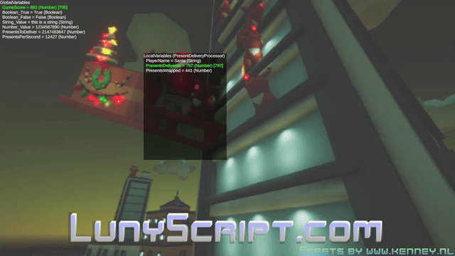
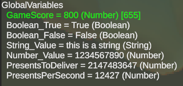

# placeholder.txt

# Debug Visualizations

I implemented basic debug visualizations.

These overlays are Unity-only and engine-native proof of concepts. Of course they will eventually work across engines once the necessary UI features have been implemented as Luny engine services.

## On-Screen Variables

This shows the state of global variables (top-left) and the selected object's local variables:

For readability, here's what the global variables show:

A monospace font, checkboxes for booleans, and thousands separators for large numbers will certainly enhance readability. And they should be editable of course.

## On-Screen Profiling Stats

Similar onscreen information from the built-in profiler, which gathers statistics of Luny engine observers:

An 'observer' is any script that builds on top of the Luny framework - like LunyScript. Since there may eventually be multiple in a project it's good to see which of these Luny sub-engines are consuming how much of time without needing to dig into engine-native profilers.
