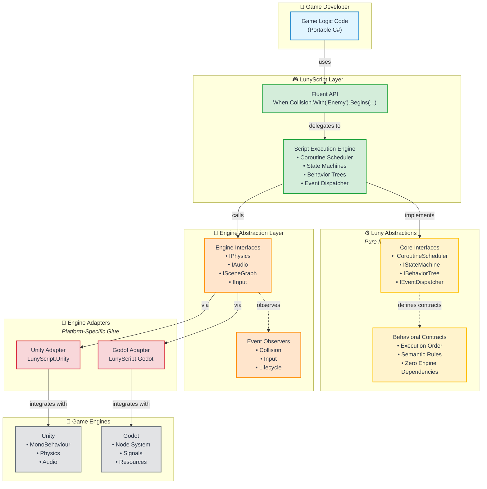

# LunyScript Architecture Diagram

This diagram illustrates the layered architecture of LunyScript, showing how portable game logic runs across multiple game engines.

## Architecture Overview



## Layer Descriptions

### 👤 Game Developer Layer
**What:** Your game logic written in C#, GDScript, or Lua
**Benefit:** Write once, deploy to multiple engines without changes

### 🎮 LunyScript Layer (Portable)
**What:** The main API you interact with - fluent, declarative, gameplay-focused
**Benefit:** Clean, readable code that expresses intent, not implementation
**Example:**
```csharp
When.Collision.With("Enemy").Begins(
    Audio.Play("hit"),
    DecrementVariable(health),
    If(IsVariableLessOrEqual(health, 0), EndGame())
);
```

### ⚙️ Luny Abstractions Layer (Foundation)
**What:** Pure interfaces and contracts with zero engine dependencies
**Benefit:** Enables custom implementations and ensures clean architecture
**Who uses it:** Advanced users extending LunyScript, not typical game developers

### 🔧 Engine Abstraction Layer (EAL)
**What:** Engine-agnostic interfaces for physics, audio, scene management, and input
**Benefit:** LunyScript code calls these interfaces, adapters implement them for each engine
**Examples:**
- **IPhysics:** Collision detection, raycasts, forces
- **IAudio:** Sound playback, 3D positioning
- **ISceneGraph:** Object hierarchy, spawning, destruction
- **IInput:** Keyboard, mouse, gamepad input

### 🔌 Engine Adapter Layer (Glue)
**What:** Platform-specific bindings that connect LunyScript to each engine
**Benefit:** Isolates engine differences, making porting straightforward
**Examples:**
- **Unity:** MonoBehaviour lifecycle, Component architecture
- **Godot:** Node system, Signals, Resources

### 🎯 Game Engine Layer
**What:** The actual game engines (Unity, Godot, etc.)
**Benefit:** Use the engine's native tools (editor, debugger, profiler) alongside LunyScript

## Key Benefits

### ✅ Portability
Same game logic runs on Unity and Godot (and future engines)

### ✅ Simplicity
Declarative API reduces boilerplate by 70-83% compared to native engine code

### ✅ Beginner-Friendly
No need to learn engine-specific patterns - focus on game logic

### ✅ Engine Freedom
Switch engines without rewriting gameplay code - avoid vendor lock-in

### ✅ Multi-Language Support
Write in C#, GDScript, or Lua - same API across all languages

## Technical Details

### Change Frequency by Layer

| Layer | Change Frequency | Why |
|-------|-----------------|-----|
| **Luny** | Low | Core abstractions rarely change once established |
| **LunyScript** | Medium | Grows with new features, core logic stable |
| **EAL** | Low-Medium | Engine interfaces evolve as LunyScript features expand |
| **Adapters** | High | Evolves with engine API changes |

### Performance Overhead

**Target:** <5% overhead compared to native engine code
**Strategy:** Static graph analysis, minimal runtime reflection, efficient event dispatching

### Supported Languages

- **C#** (Primary) - Full API support
- **GDScript** (Godot) - Via code generator
- **Lua** (Godot/other) - Via code generator

## Example: The Same Code, Multiple Engines

```csharp
// This exact code works in Unity and Godot
protected override void OnReady()
{
    var score = Variables.Set("Score", 0);
    HUD.BindVariable(score);

    When.Collision.With("Coin").Begins(
        IncrementVariable(score),
        Audio.Play("coin_pickup")
    );
}
```

**Unity:** Runs in MonoBehaviour
**Godot:** Runs in Node script

Same code, multiple engines, zero changes. 🎉

## Learn More

- [Architecture Details](Architecture.md)
- [Code Comparison](CodeComparison.md)
- [Philosophy](Philosophy.md)
- [Proof of Concept](../PoC_2025-10/)
