# LunyScript Architecture Diagram

This diagram illustrates the layered architecture of LunyScript, showing how portable game logic runs across multiple game engines.

## Architecture Overview

```mermaid
%%{init: {'theme':'base', 'themeVariables': {
  'fontSize':'16px',
  'edgeLabelBackground':'#ffffff',
  'labelBoxBorderColor':'#999'
}}}%%
graph TB
    subgraph User[" "]
        UserTitle["<b>👤 Game Developer</b>"]
        UserCode["Game Logic Code<br/>(Portable C#)"]
    end

    subgraph LunyScript[" "]
        LSTitle["<b>🎮 LunyScript Layer</b><br/><i>Write Once, Run Anywhere</i>"]
        FluentAPI["Fluent API<br/>When.Collision.With('Enemy').Begins(...)"]
        CoreLogic["Script Execution Engine<br/>• Coroutine Scheduler<br/>• State Machines<br/>• Behavior Trees<br/>• Event Dispatcher"]
    end

    subgraph Luny[" "]
        LunyTitle["<b>⚙️ Luny Abstractions</b><br/><i>Pure Interfaces & Contracts</i>"]
        Interfaces["Core Interfaces<br/>• ICoroutineScheduler<br/>• IStateMachine<br/>• IBehaviorTree<br/>• IEventDispatcher"]
        Contracts["Behavioral Contracts<br/>• Execution Order<br/>• Semantic Rules<br/>• Zero Engine Dependencies"]
    end

    subgraph EAL[" "]
        EALTitle["<b>🔧 Engine Abstraction Layer</b><br/><i>Luny.EAL</i>"]
        EALInterfaces["Engine Interfaces<br/>• IPhysics<br/>• IAudio<br/>• ISceneGraph<br/>• IInput"]
        EALObservers["Event Observers<br/>• Collision<br/>• Input<br/>• Lifecycle"]
    end

    subgraph Adapters[" "]
        AdapterTitle["<b>🔌 Engine Adapters</b><br/><i>Platform-Specific Glue</i>"]
        UnityAdapter["Unity Adapter<br/>LunyScript.Unity"]
        GodotAdapter["Godot Adapter<br/>LunyScript.Godot"]
    end

    subgraph Engines[" "]
        EngineTitle["<b>🎯 Game Engines</b>"]
        Unity["Unity<br/>• MonoBehaviour<br/>• Physics<br/>• Audio"]
        Godot["Godot<br/>• Node System<br/>• Signals<br/>• Resources"]
    end

    UserCode -->|"&nbsp; uses &nbsp;"| FluentAPI
    FluentAPI -->|"&nbsp; delegates to &nbsp;"| CoreLogic
    CoreLogic -->|"&nbsp; implements &nbsp;"| Interfaces
    Interfaces -.->|"&nbsp; defines contracts &nbsp;"| Contracts

    CoreLogic -->|"&nbsp; calls &nbsp;"| EALInterfaces
    EALInterfaces -.->|"&nbsp; observes &nbsp;"| EALObservers

    EALObservers -.->|"&nbsp; implemented by &nbsp;"| UnityAdapter
    EALObservers -.->|"&nbsp; implemented by &nbsp;"| GodotAdapter

    UnityAdapter -->|"&nbsp; integrates with &nbsp;"| Unity
    GodotAdapter -->|"&nbsp; integrates with &nbsp;"| Godot

    classDef userLayer fill:#e1f5ff,stroke:#0077cc,stroke-width:2px,color:#2d3748
    classDef lunyScriptLayer fill:#d4edda,stroke:#28a745,stroke-width:2px,color:#2d3748
    classDef lunyLayer fill:#fff3cd,stroke:#ffc107,stroke-width:2px,color:#2d3748
    classDef ealLayer fill:#ffe5cc,stroke:#ff8c00,stroke-width:2px,color:#2d3748
    classDef adapterLayer fill:#f8d7da,stroke:#dc3545,stroke-width:2px,color:#2d3748
    classDef engineLayer fill:#e2e3e5,stroke:#6c757d,stroke-width:2px,color:#2d3748
    classDef titleStyle fill:none,stroke:none,color:#2d3748,font-size:20px

    class UserCode userLayer
    class FluentAPI,CoreLogic lunyScriptLayer
    class Interfaces,Contracts lunyLayer
    class EALInterfaces,EALObservers ealLayer
    class UnityAdapter,GodotAdapter adapterLayer
    class Unity,Godot engineLayer
    class UserTitle,LSTitle,LunyTitle,EALTitle,AdapterTitle,EngineTitle titleStyle
```

<div id="diagram-container" style="width: 100%; overflow-x: auto; cursor: pointer; position: relative;">
<div style="text-align: center; font-size: 12px; color: #666; margin-bottom: 10px;">
  <em>Click diagram to view full size ⤢</em>
</div>



</div>

## Layer Descriptions

### 👤 Game Developer Layer
- **What:** Your game logic written in C# (Lua)
- **Benefit:** Write once, deploy to multiple engines without changes

### 🎮 LunyScript Layer (Portable)
- **What:** The main API you interact with - fluent, declarative, gameplay-focused
- **Benefit:** Clean, readable code that expresses intent, not implementation
- **Example:**
```csharp
When.Collision.With("Enemy").Begins(
    Audio.Play("hit"),
    DecrementVariable(health),
    If(IsVariableLessOrEqual(health, 0), EndGame())
);
```

### ⚙️ Luny Abstractions Layer (Foundation)
- **What:** Pure interfaces and contracts with zero engine dependencies
- **Benefit:** Enables custom implementations and ensures clean architecture
- **Who uses it:** Advanced users extending LunyScript, not typical game developers

### 🔧 Engine Abstraction Layer (EAL)
- **What:** Engine-agnostic interfaces for physics, audio, scene, input, etc.
- **Benefit:** LunyScript calls interfaces, adapters implement them for each engine

**Examples:**
- **IPhysics:** Collision detection, raycasts, forces
- **IAudio:** Sound playback, 3D positioning
- **ISceneGraph:** Object hierarchy, spawning, destruction
- **IInput:** Keyboard, mouse, gamepad input

### 🔌 Engine Adapter Layer (Glue)
- **What:** Platform-specific bindings that connect LunyScript to each engine
- **Benefit:** Isolates engine differences, making porting straightforward. 
- **Escape Hatch:** Users can extend with engine-native method overrides, bypassing the engine-agnostic layer.

**Examples:**
- **Unity:** MonoBehaviour lifecycle, Component architecture
- **Godot:** Node system, Signals, Resources

### 🎯 Game Engine Layer
- **What:** The actual game engines (Unity, Godot, etc.)
- **Benefit:** Use the engine's tools (editor, debugger, profiler) alongside LunyScript

---

## Extensibility: Build Your Own Cross-Engine Framework

LunyScript's architecture enables other developers to build their own cross-engine frameworks by reusing and extending the abstraction layers and engine adapters.

<div id="extensibility-diagram-container" style="width: 100%; overflow-x: auto; cursor: pointer; position: relative;">
<div style="text-align: center; font-size: 12px; color: #666; margin-bottom: 10px;">
  <em>Click diagram to view full size ⤢</em>
</div>


</div>

### How It Works

**1. LunyScript provides the foundation:**
- ⚙️ **Luny Abstractions** - Interfaces for schedulers, state machines, behavior trees
- 🔧 **Engine Abstraction Layer (EAL)** - Engine-agnostic interfaces for physics, audio, input, scenes, etc.
- 🔌 **Engine Adapters** - Implementations for Unity, Godot, and future engines

**2. You build on top:**
- 🎨 Create your own domain-specific API (e.g., visual novel framework, RTS framework, card game framework)
- 🔗 Use Luny Abstractions for behavior and state management
- 🎯 Call EAL interfaces for cross-engine functionality
- ✨ Focus on your framework's unique features, not engine integration

**3. Benefits for framework developers:**
- ✅ **Skip the hard part** - Engine integration already done
- ✅ **Instant multi-engine support** - Works on Unity, Godot, etc. automatically
- ✅ **Share the ecosystem** - All frameworks benefit from new engine adapters
- ✅ **Focus on your domain** - Build features, not plumbing
- ✅ **Provide more value** - Write for mankind, not engines.

**Example: A Visual Novel Framework**
```csharp
// Your custom framework built on LunyScript foundation
public class VisualNovelScene : LunyScriptBehavior
{
    protected override void OnReady()
    {
        // Use EAL for audio/input
        When(ButtonClicked("Choice1"),
            Audio.Play("choice_sound"),
            LoadScene("chapter2")
        );

        // Use Luny Abstractions for state management
        var dialogueState = StateMachine.Create()
            .State("Intro", ShowDialogue("Welcome..."))
            .State("Choice", ShowChoices())
            .Transition("Intro", "Choice", After(5));
    }
}
```

---

## Key Benefits

### ✅ Portability
Same game logic runs on Unity and Godot (and future engines)

### ✅ Simplicity
Declarative API reduces boilerplate by 70-83% compared to native engine code

### ✅ Beginner-Friendly
No need to learn engine-specific patterns - focus on game logic

### ✅ Engine Freedom
Switch engines without rewriting gameplay code - avoid vendor lock-in

### ✅ Multi-Language Support
Write in C# (Lua) - same API across all languages

## Technical Details

### Change Frequency by Layer

| Layer | Change Frequency | Why                                                    |
|-------|-----------------|--------------------------------------------------------|
| **Luny** | Low | Core abstractions rarely change once established       |
| **LunyScript** | Medium | Grows with new features, core logic stable             |
| **EAL** | Low-Medium | Engine interfaces evolve as LunyScript features expand |
| **Adapters** | High | Evolves with engine API changes, but low effort        |

### Performance Overhead

- **Target:** <5% overhead compared to native engine code
- **Strategy:** Static graph analysis, minimal runtime reflection, efficient event dispatching

### Supported Languages

- **C#** (Primary) - Full API support for C# engines
- **Lua** (Secondary) - Bindings via code generator, all engines, uses LuaCSharp

_Under Consideration:_
- **GDScript** (Godot) - Wait for demand, fluent syntax would be awkward (newline backslashes!) 
- **C++** (Last) - Years away. Would provide native Unreal and O3DE, Cocos support.

With a C++ implementation Lua code would ensure full portability to C# engines.

## Example: The Same Code, Multiple Engines

```csharp
// This exact code works in Unity and Godot
protected override void OnReady()
{
    var score = Variables.Set("Score", 0);
    HUD.BindVariable(score);

    When.Collision.With("Coin").Begins(
        IncrementVariable(score),
        Audio.Play("coin_pickup")
    );
}
```

- **Unity:** Runs in MonoBehaviour
- **Godot:** Runs in Node script

Same code, multiple engines, zero changes. 🎉

The goal is to have this code in an engine-agnostic subclass, but this has not been fully evaluated in regards to editor integration and user's workflow.

## Learn More

- [Architecture Details](Architecture.md)
- [Code Comparison](CodeComparison.md)
- [Philosophy](Philosophy.md)
- [Proof of Concept](../PoC_2025-10/)
