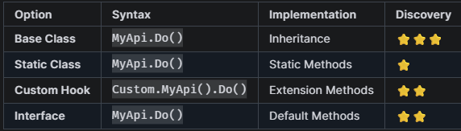
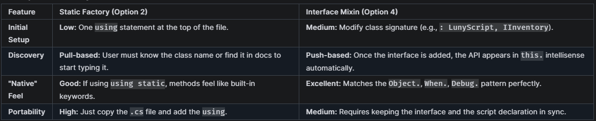

# ExtendingLunyScriptApi.md

To enable users to write their own APIs that feel "native" within the LunyScript fluent environment, there are several architectural patterns available. 

Here are the recommended options:

## 1. Game-Specific Base Class 
### Most native feel; Only for 'internal use'

   The most "native" feel is achieved by defining a project-specific `LunyScript` base class. This allows you to provide properties like MyApi that show up in Intellisense just like When or Object.

    // In your game project
    public abstract class OurLunyScriptBase : LunyScript
    {
       public InventoryApi Inventory => new InventoryApi(this);
    }
    
    public readonly struct InventoryApi
    {
        private readonly LunyScript _script;
        internal InventoryApi(LunyScript script) => _script = script;
    
        public IScriptActionBlock AddCoins(int coins)
            => InventoryAddCoinsBlock.Create(coins);
    }
    
    // Usage in a script
    public class Player : OurLunyScriptBase
    {
        public override void Build()
        {
            // Inventory use feels like 'native' API:
            When.Self.Updates(Inventory.AddCoins(1));
        }
    }

- Pros: Perfectly matches the native API feel; full Intellisense support.
- Cons: Requires users to inherit from your `GameScript` instead of the base LunyScript. Scripts not portable to projects without `GameScript`.

## 2. Static Factory Classes
### Cleanest Syntax; Good for Sharing; No 'this' context

   Many of the built-in API blocks (like Debug.LogInfo) don't actually require the LunyScript instance at creation time because they receive the ILunyScriptContext at execution time. You can exploit this to create a "Global" API feel.

    // static factory where 'this' (LunyScript) is not needed
    public static class Inventory
    {
        public static IScriptActionBlock AddCoins(int coins) 
            => InventoryAddCoinsBlock.Create(coins);
    }
    
    // Usage in Build()
    public override void Build()
    {
        // Inventory use feels like 'native' API:
        When.Self.Updates(Inventory.AddCoins(2));
    }

- Pros: Cleanest usage; no indirection needed; can be used anywhere. Easy to distribute as "drop-in" .cs file. Full discovery just by adding using statement. 
- Cons: Can't use 'this', not discoverable by typing 'this.'; requires adding a using statement or fully qualified class name.

## 3. Roslyn Generator

Provided by LunyScript Engine, it will ease writing and using API extensions.

For solution #4 (next) it will inject the otherwise required "cast to interface" property to make the use of a mixin interface straightforward

## 4. Mixin via Interface 
### Native Feel; Recommended for Sharing
   
You can use interfaces with default implementations to "inject" properties into a script class.

    [LunyScriptExtension] // <== registers interface as LunyScript extension
    public interface IInventory
    {
        InventoryApi Inventory => new InventoryApi((LunyScript)this);
    }

    [LunyScriptApi] // <== registers struct as providing LunyScript API
    public readonly struct InventoryApi
    {
        private readonly LunyScript _script;
        internal InventoryApi(LunyScript script) => _script = script;
    
        public IScriptActionBlock AddCoins(int coins)
            => InventoryAddCoinsBlock.Create(coins);
    }
    
    // 'partial' keyword required
    public partial class Player : LunyScript, IInventoryApi // <== make Inventory API available
    {
        // GENERATED by Roslyn to hide the casting noise:
        InventoryApi Inventory => ((IInventoryApi)this).Inventory;

        public override void Build()
        {
            // Inventory use feels like 'native' API:
            When.Self.Updates(Inventory.AddCoins(4));
        }
    }

- Pros: Feels very native; avoids inheritance depth issues. Interfaces highlight what extension the script is using. Discovery is granular.
- Cons: Requires the user to add the 'partial' keyword and individual interfaces.

## Summary Comparison

All solutions result in the same 'native' feel:

Note: **Custom Hook** solution was removed from document due to its additional bracket noise and "Custom" prefix.

### User Friction

- **Base Class Friction**: Must use a custom base class for each script. Splitting base classes can lead to [diamond problem](https://de.wikipedia.org/wiki/Diamond-Problem){:target="_blank"}. Not for public sharing.
- **Static Factory Friction**: No friction other than discovery: Factories are in global namespace and autocomplete suggestions don't tell what is a valid LunyScript factory. Could encode in name (eg `LunyScriptInventory`) but makes API verbose.
- **Interface Mixin Friction**: The friction is the `partial` requirement and varying interfaces on scripts. However, it serves as explicit documentation: "This script is an NPC, it has an Inventory, and it uses Combat."

### Usage Recommendations

- **Pro Sharing**: #4 Interface Mixins => Best discovery and granularity.
- **Easy Sharing**: #2 Static Factory => Easiest, but less discoverable, no 'this' context.
- **Internal Use**: #1 Base Class => No interface friction, best discovery.
