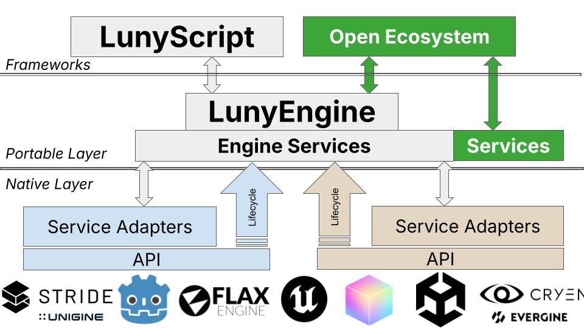

# Design Documentation

Welcome to the LunyScript design documentation. This section covers the architecture, technical decisions, and implementation details.

## Design & Philosophy

- [Problem Statement](ProblemStatement.md) - Why LunyScript exists and what problems it solves
- [Vision](../VISION.md) - Long-term vision and desired outcomes
- [Author](../AUTHOR.md) - About the author and personal experience
- [Philosophy](Philosophy.md) - API design philosophy and principles
- [FAQ](../FAQ.md) - Frequently asked questions

## 📐 Architecture

<iframe width="648" height="365" src="https://www.youtube.com/embed/0Wlz7obQwOY" frameborder="0" allow="accelerometer; autoplay; clipboard-write; encrypted-media; gyroscope; picture-in-picture" allowfullscreen></iframe>

### A Diagram Says More Than a Thousand UMLs

LunyEngine is an engine-agnostic Developer SDK that opens engine ecosystems. We need to stop re-inventing gameplay wheels in every engine separately! The native service adapters are (ultra-)thin API mappings.

## Technical Documentation

- [Engine Differences](EngineDifferences.md) - How engines differ and how LunyScript unifies them
- [Architecture](Architecture.md) - System architecture and layer structure
- [Code Comparison](CodeComparison.md) - Side-by-side comparison: LunyScript vs traditional approaches

### Design Risk Assessment
- [Cross-Cutting Concerns](CrossCuttingConcerns.md) - Architectural concerns requiring upfront design
- [Cross-Engine Concerns](CrossEngineConcerns.md) - Feature requirements and portability risks

## 🔗 Quick Links
- [← Back to Home](../)

---

##### **AI Usage Info**

AI-assisted development. AI usage is adheres to FOSS principles: **→ [FOSS-compliant AI-Usage](../AI-USAGE.md)**
