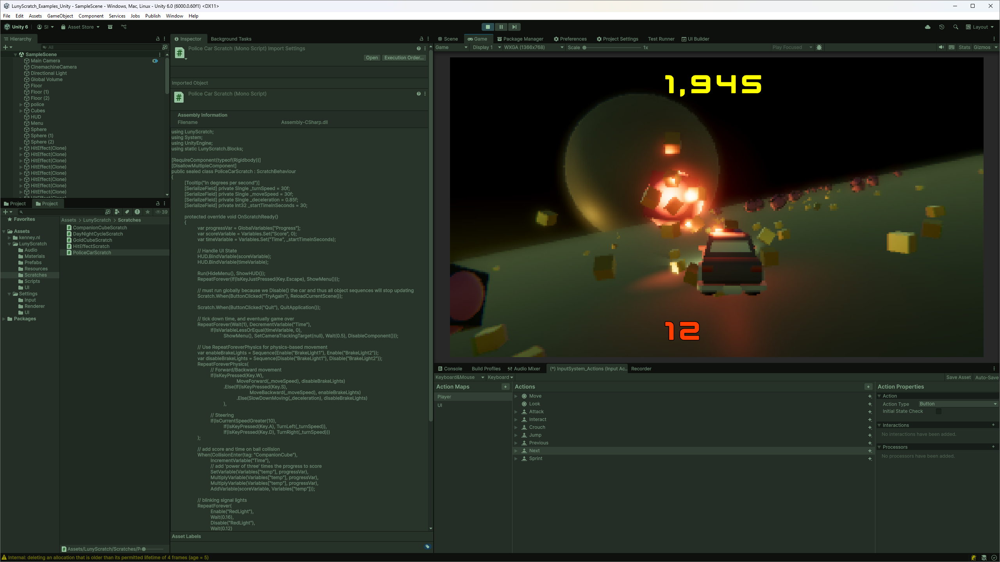
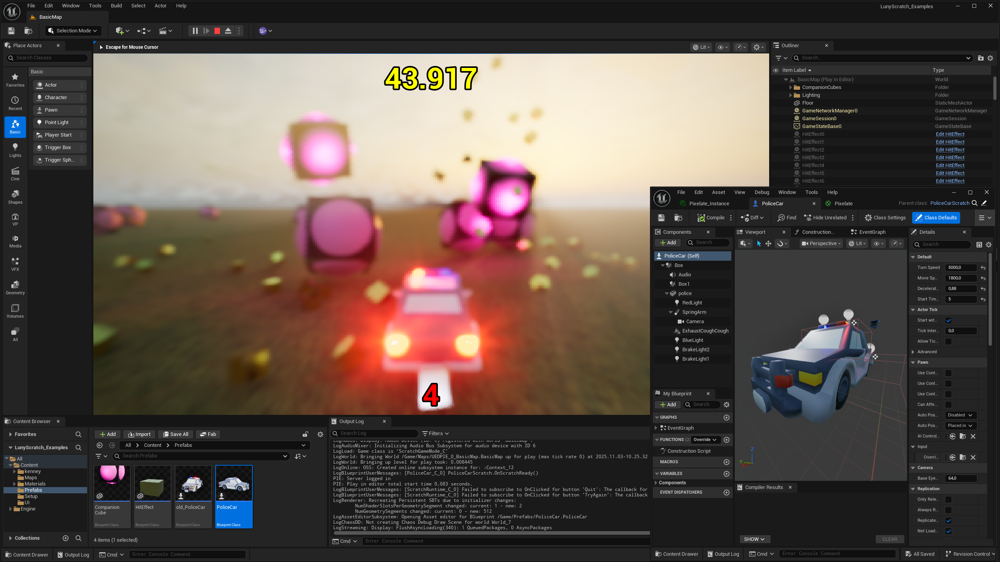
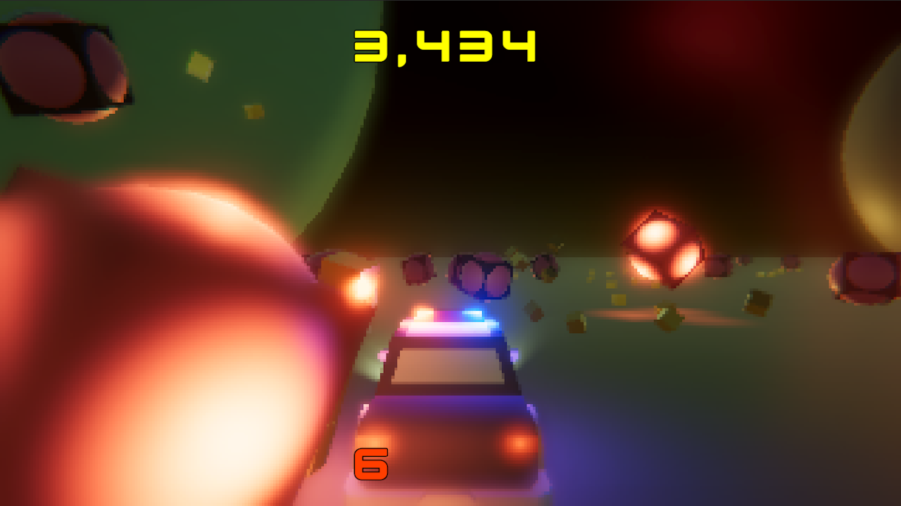
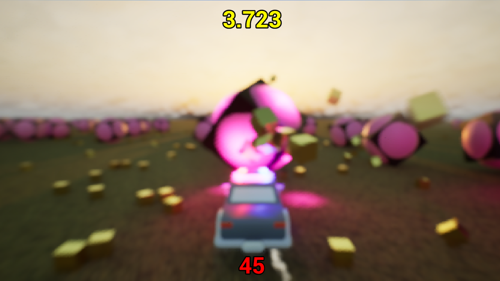

# LunyScript - Cross-Engine Gameplay Scripting

## Works the same in Unity, Godot, Unreal, ...

    When.Collision.With("ball")
        .Begins(Audio.Play("ball_tagged_loop"))
        .Ends(Spawn("sparkles").At(Other).Run(Wait.Seconds(2.5), Despawn()))

Different Engine: Same Behaviour 
Different Language: Same Semantics

---

## This can't possibly work !!

It does! Here's the proof: same code, same game, runs in Unreal, Unity, and Godot.

 
**[Watch the full video on Youtube (1:20)](https://youtu.be/Vn38VLNDsuw "LunyScript: Same Code, Three Engines - Proof of Concept Demo")**

A vertical slice from scratch in under 20 days. Started with Unity, then ported to Godot and Unreal in 3 days each.

> 🚧 **Status: Proof of Concept - Not Production Ready**
> LunyScript is currently in early research and design phase. The proof of concept demonstrates feasibility, but this is not ready for education / real projects.
> See [Roadmap](#roadmap) for development timeline and [LIMITATIONS.md](LIMITATIONS.md) for current scope and boundaries.

### What's Currently Implemented (Proof of Concept)

The PoC demonstrates LunyScript orchestrating essential gameplay systems across all three engines:

| System | Features Demonstrated |
|--------|---------------------|
| **Input** | Keyboard input detection |
| **Physics** | Rigidbody movement, forces, velocity control |
| **Collision** | Collision detection events, collision filtering |
| **Assets** | prefab addressing, instantiation |
| **Scene Graph** | Object create/destroy, find children by name, transform |
| **UI** | Text display, Variable binding, Button press events |
| **Variables** | game state and progression, timer & score |
| **Audio** | Sound effect playback |

**Scope:** High-level gameplay scripting - orchestrating game logic, behaviors, and interactions. LunyScript is **not** a game engine API replacement.

## Screenshots

| Godot | Unity | Unreal |
|-------|-------|--------|
|  |  |  |
|  |  |  |

---

## But why?

**Visual tools like PlayMaker** ($65, >3.4k reviews, 20k favorites) and Blueprints prove there's massive demand for simplifying game logic — even among professionals.

But visual programming is verbose, painful to debug, refactor, version control, document. Yet it still requires imperative programming skills.

LunyScript gives you **high-level game logic** — readable, customizable, and runs across engines. With all benefits of text-based editing and powerful IDEs.

## Use Cases

**For Learners & Educators (PRIMARY AUDIENCE)**
- Simple and fun, focus learning on creation and workflows. Feel at ease: your hard-earned skills and code will transfer.
- Teach one code curriculum across multiple engines - focus on game design, patterns and tooling, not API memorization and syntax.
- Lowers barrier of entry: less boilerplate, immediate results, ease into imperative, engine-native programming at your own pace.

**For Framework & Tool Developers** ([Share your pains/needs](https://github.com/CodeSmile-0000011110110111/LunyScript-RFC/discussions))
- Build integrated cross-engine solutions, instead of engine-locked or engine-agnostic.
- Leverage LunyScript's engine-agnostic abstractions to reach wider audiences, lower costs of distributed plugins.

**For Multi-Engine Studios** ([Share your pains/needs](https://github.com/CodeSmile-0000011110110111/LunyScript-RFC/discussions))
- Share gameplay code across projects built with different engines.
- Staff and planning become more flexible, with faster onboarding.

**For Everyone**
- Write behavior, not plumbing - less boilerplate, more intent.
- Insurance against engine ecosystem lock-in, easier to jump ship.

## Roadmap

- **Phase 1:** Unity Implementation; API Design; Portable Layer; Demos and Docs (6 months => Q1/Q2 2026)
- **Phase 2:** Port to Godot w/ Demos; Cross-Engine Verification Tests; Polish Onboarding (6 months => Q3/Q4 2026)
- **Phase 3:** Promote to Learners/Educators; Stabilize Architecture & Behaviour Contracts (4 months = Q1 2027)

### **Long-Term**

- Foster contributions, invite FOSS engines
- Encourage autonomous maintainers of Engine Adapter (they know 'their' engine best)
- Support Cross-Engine Framework (CEF) developers adopting _Luny_ (cross-engine abstraction layer)

**Maintenance:** See [MAINTENANCE.md](MAINTENANCE.md) for the long-term sustainability strategy and how engine adapters are maintained.

---

## Why Not Just...?

**Why not just learn the engine API properly?**

LunyScript doesn't replace engine knowledge - it's for **gameplay scripting** which is a beginner's **immediate interest**! LunyScript helps you ease into imperative programming and engine APIs at your own pace at a point during learning where the user simply cannot assess whether this or that engine is the best option for learning, project and career goals.

**Why not a general purpose framework, like Rx.NET?**

General purpose frameworks are too abstract for beginners. They are loaded with CS jargon and concepts. LunyScript provides **high-level, fluent gameplay APIs** that read like game design intent. See the [FAQ](FAQ.md) for direct code comparison.

**Why not write your own game engine (perhaps based on SDL)?**

LunyScript is for ease of entry and productivity in pro-tier game engines, and perhaps contributes to popularizing emerging engines. Creating a custom "Luny" game engine would defeat those purposes. Currently, roughly 95% of Steam games published are made with Unity, Unreal, Godot, and proprietary engines. This is where the learning pains are felt most.

**Why not just use visual scripting?**

Visual scripting tools (PlayMaker, Blueprints, etc.) are a popular choice for many non-programmers. But they are currently the ONLY choice for users intimidated by conventional programming. Visual tools are criticized for being verbose and space inefficient, and require a high degree of UI interactions. They are painful to version control, code review, refactor, and document. LunyScript provides the same **high-level expressiveness and simplicity** with all the benefits of text-based code - a **viable alternative** for beginners & designers based on my own experience.

More Questions? See the [FAQ](FAQ.md) or:

# Join the Discussion!

**Share your thoughts, ask questions, propose ideas!**

[Join the Discussions](https://github.com/CodeSmile-0000011110110111/LunyScript-RFC/discussions/)
to help shape the future of cross-engine gameplay code and framework development!

---

# Proof of Concept

## Repositories

| Godot | Unity | Unreal |
|-------|-------|--------|
| [Godot PoC Repository](https://github.com/CodeSmile-0000011110110111/LunyScratch_Examples_Godot) | [Unity PoC Repository](https://github.com/CodeSmile-0000011110110111/LunyScratch_Examples_Unity) | [Unreal PoC Repository](https://github.com/CodeSmile-0000011110110111/LunyScratch_Examples_Unreal) |

## PoC Example Source Code

This is the script for the "Police Car" which acts as both player controller and overall game state.

⚠️ API in Proof of Concept represents an early first draft. Final API will differ in key aspects. And it isn't supposed to leak engine details. ⚠️

    using Godot;
    using LunyScratch;
    using System;
    using static LunyScratch.Blocks;
    using Key = LunyScratch.Key;
    
    public sealed partial class PoliceCarScratch : ScratchRigidbody3D
    {
        [Export] private Single _turnSpeed = 70f;
        [Export] private Single _moveSpeed = 16f;
        [Export] private Single _deceleration = 0.85f;
        [Export] private Int32 _startTimeInSeconds = 5;
    
        protected override void OnScratchReady()
        {
            var progressVar = GlobalVariables["Progress"];
            var scoreVariable = Variables.Set("Score", 0);
            var timeVariable = Variables.Set("Time", _startTimeInSeconds);
    
            // Handle UI State
            HUD.BindVariable(scoreVariable);
            HUD.BindVariable(timeVariable);
    
            Run(HideMenu(), ShowHUD());
            RepeatForever(If(IsKeyJustPressed(Key.Escape), ShowMenu()));
    
            // must run globally because we Disable() the car and thus all object sequences will stop updating
            Scratch.When(ButtonClicked("TryAgain"), ReloadCurrentScene());
            Scratch.When(ButtonClicked("Quit"), QuitApplication());
    
            // tick down time, and eventually game over
            RepeatForever(Wait(1), DecrementVariable("Time"),
                If(IsVariableLessOrEqual(timeVariable, 0),
                    ShowMenu(), SetCameraTrackingTarget(null), Wait(0.5), DisableComponent()));
    
            // Use RepeatForeverPhysics for physics-based movement
            var enableBrakeLights = Sequence(Enable("BrakeLight1"), Enable("BrakeLight2"));
            var disableBrakeLights = Sequence(Disable("BrakeLight1"), Disable("BrakeLight2"));
            RepeatForeverPhysics(
                // Forward/Backward movement
                If(IsKeyPressed(Key.W),
                        MoveForward(_moveSpeed), disableBrakeLights)
                    .Else(If(IsKeyPressed(Key.S),
                            MoveBackward(_moveSpeed), enableBrakeLights)
                        .Else(SlowDownMoving(_deceleration), disableBrakeLights)
                    ),
    
                // Steering
                If(IsCurrentSpeedGreater(0.1),
                    If(IsKeyPressed(Key.A), TurnLeft(_turnSpeed)),
                    If(IsKeyPressed(Key.D), TurnRight(_turnSpeed)))
            );
    
            // add score and time on ball collision
            When(CollisionEnter(tag: "CompanionCube"),
                IncrementVariable("Time"),
                // add 'power of three' times the progress to score
                SetVariable(Variables["temp"], progressVar),
                MultiplyVariable(Variables["temp"], progressVar),
                MultiplyVariable(Variables["temp"], progressVar),
                AddVariable(scoreVariable, Variables["temp"]));
    
            // blinking signal lights
            RepeatForever(
                Enable("RedLight"),
                Wait(0.16),
                Disable("RedLight"),
                Wait(0.12)
            );
            RepeatForever(
                Disable("BlueLight"),
                Wait(0.13),
                Enable("BlueLight"),
                Wait(0.17)
            );
    
            // Helpers
            // don't play minicube sound too often
            RepeatForever(DecrementVariable(GlobalVariables["MiniCubeSoundTimeout"]));
            // increment progress (score increment) every so often
            RepeatForever(IncrementVariable(progressVar), Wait(15), PlaySound());
        }
    }
