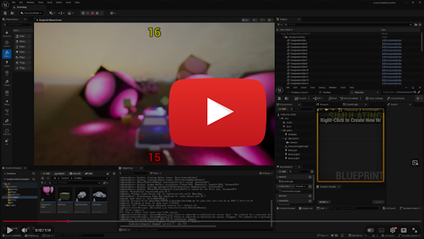

# LunyScript

## Same code, same outcome! In Unity, Godot, Unreal ...

    When.Collision.With("ball")
        .Begins(Audio.Play("ball_tagged_loop"))
        .Ends(Spawn("sparkles").At(Other).Run(Wait.Seconds(2.5), Despawn()))

Different engine, different language - same behaviour, same semantics!

## This can't possibly work !!

It does! Here's the proof: same code, same game, runs in Unreal, Unity, and Godot.

A vertical slice from scratch in under 20 days. Started with Unity, then ported to Godot and Unreal in 3 days each.

The proof of concept shows that LunyScript can exercise all relevant game systems across engines:
- Input, Physics, Collision, Assets, Scene Graph, UI, Variables, Audio

## Screenshots
| Godot                                                                                           | Unity                                                                                             | Unreal                                                                                              |
|---------------------------------------------------------------------------------------------------|---------------------------------------------------------------------------------------------------|-----------------------------------------------------------------------------------------------------|
|  |  |  |
|                |                |                |

## But why?

**Visual tools like PlayMaker** ($65, >3.4k reviews, 20k favorites) prove there's massive demand for simplifying game logic — even among professionals.

But visual programming is painful to debug and refactor, hard to document and collaborate on - yet still requiring imperative programming skills.

LunyScript gives you **high-level game logic as code at near-native performance** — readable, customizable, and runs across engines.

## Use Cases

**For learners:** Your hard-earned skills **AND** code transfer if you switch engines. No more restarting from scratch.

**For multi-engine studios:** Teams don't fragment along engine-specific roles **AND** code works across projects.

**For everyone:** Less boilerplate, more intent. Write behavior, not plumbing. Build reusable libraries.

## Benefits

**Impress with results:** Less code and fewer errors than with conventional or visual programming.

**Teach to larger audiences:** Teach horizontally across engines with a single code curriculum.

**Decrease engine lock-in:** Take your assets **and your code** with you. Build long-lasting behaviour libraries.

**Wider reach, lower costs:** Multi-engine frameworks and plugins can build on LunyScript's abstractions.

## Roadmap

- **Phase 1:** API Design, Portable Abstractions, Unity Implementation + Demos, Docs (6 months => Q1/Q2 2026)
- **Phase 2:** Port to Godot w/ Demos; Cross-Engine Verification Tests; Polish API & Onboarding (6 months => Q3/Q4 2026)
- **Phase 3:** Promote to Learners/Educators; Stabilize Architecture & Behaviour Contracts (4 months = Q1 2027)
- **Phase 4:** (LunyScript Lua Modding in Published Project) || (More Languages/Engines) || ?? .. (6 months => Q2 2027)

### **Long-Term Goals**

- Foster contributions, invite FOSS engines
- Encourage autonomous maintainers of Engine Adapter (they know 'their' engine best)
- Support Cross-Engine Framework (CEF) developers adopting _Luny_ (cross-engine abstraction layer)

## Join the Discussion!

**Share your thoughts, ask questions, propose ideas!**

[Join the Discussions](https://github.com/CodeSmile-0000011110110111/LunyScript-RFC/discussions/)
to help shape the future of cross-engine software development!

Luny: Adding value to multiple engines on an equal footing.

---
---

# Proof of Concept Links

## Repositories

| [Godot PoC Repository](https://github.com/CodeSmile-0000011110110111/LunyScratch_Examples_Godot)            | [Unity PoC Repository](https://github.com/CodeSmile-0000011110110111/LunyScratch_Examples_Unity)  | [Unreal PoC Repository](https://github.com/CodeSmile-0000011110110111/LunyScratch_Examples_Unreal)|
|---------------------------------------------------------------------------------------------------|---------------------------------------------------------------------------------------------------|-----------------------------------------------------------------------------------------------------|

### PoC Example Source Code

Note: API in Proof of Concept represents an early first draft. Final API will differ in key aspects.

- [PoliceCarScratch.cs](2025-10_Proof_Of_Concept_Demo/PoliceCarScratch.cs)
- [CompanionCubeScratch.cs](2025-10_Proof_Of_Concept_Demo/CompanionCubeScratch.cs)
- [HitEffectScratch.cs](2025-10_Proof_Of_Concept_Demo/HitEffectScratch.cs)

---
---

# Frequently Asked Questions (FAQ)

## Isn't LunyScript just adding one more custom engine API?

Engine API semantics are needlessly disparate: `BeginPlay`, `OnEnable`, `_enter_tree`.
Every engine has the same lifecycle events. Their semantics differ, their purpose is uniform.

And their behaviour? There's no contract. In which order children receive lifecycle events varies.

LunyScript is stickier: It's **the uniform API** to bind them all! 

## Isn't this just xyz Reactive?

It is reactive.

Let's compare it with general-purpose (but Unity-only) UniRx:

    this.OnCollisionEnterAsObservable()
        .Where(c => c.gameObject.CompareTag("ball"))
        .Do(_ => audioSource.Play())
        .Subscribe();

    this.OnCollisionExitAsObservable()
        .Where(c => c.gameObject.CompareTag("ball"))
        .SelectMany(_ => Observable.Timer(TimeSpan.FromSeconds(2.5)))
        .Do(_ => Instantiate(sparkles, other.position))
        .Subscribe(_ => sparkles.Despawn());

The same code in LunyScript:

    When.Collision.With("ball")
        .Begins(Audio.Play("ball_tagged_loop"))
        .Ends(Spawn("sparkles").At(Other).Run(Wait.Seconds(2.5), Despawn()));

LunyScript code is 66% less verbose than UniRx and reads like intent.

CS jargon is loading semantics with assumptions, raising questions:

> "Hmm .. select many an observable timer?"

If you read it out loud it just makes no sense! 
That's where beginners and designers walk away!

## It's going to be a maintenance nightmare!

The shared engine features and behaviours have settled.
They are so fundamental to every project that they resist change.

LunyScript will not chase fancy new features.
Anyone can add whatever they want however.

The engine adapters and observers are in separate, engine-specific repositories.
I needn't manage and maintain every engine integration myself.

70% of LunyScript is fully portable, providing the behavioral guarantees.
The engine-native code is just 30% - mostly automatable glue.

## Results won't replicate precisely!

They needn't. Close enough is good enough. The behaviour contract is most important!

Even if you have to tweak every physics value once more, the logic itself is already running in the new engine, unchanged!

That's a lot more productive than having to start with _no code_, or worse: having to _verify and fix_ automatically converted code in a foreign environment.

## Like, how? Reflection? Source Generation?

Neither.

It's processing static graphs (FSMs, BTs) on engine heartbeat events
via a central script runner.

Infrequent native events are observed and trapped for a single frame
by handlers like `Collision.Begins`.

LunyScript handles 'structural changes' (eg destroy object) gracefully by
activating associated events (ie `When.Self.Disables`, `When.Self.Destroys`)
while deferring native execution to the 'end of frame' event.

A simple source generator will be used to create the API's static
language bindings (C# to Lua, C# to GDScript).

## Any abstraction adds overhead! Games need performance!

We're long past the days when we needed to count bytes and CPU cycles. Our games are already full of layers of abstractions.

Code we write in C# crosses the language boundary to C++ - this is rather costly.
It still worked wonderfully for Unity. Same with Blueprints: we know it's between 100x to 1,000x slower than C++ yet we use it extensively.

LunyScript, through its central processing concept and internal caching, may even
prove to be faster when compared to ubiquitous uses of `GameObject.Find("")` or
the commonplace trainwrecks:

    if (gameObject.transform.GetComponent<Rigidbody>() != null)
    {
        gameObject.transform.GetComponent<Rigidbody>().linearVelocity = 0;
        gameObject.transform.GetComponent<Rigidbody>().angularVelocity = 0;
        gameObject.transform.GetComponent<Rigidbody>().Sleep();
    }

As seen on a worryingly regular basis.
