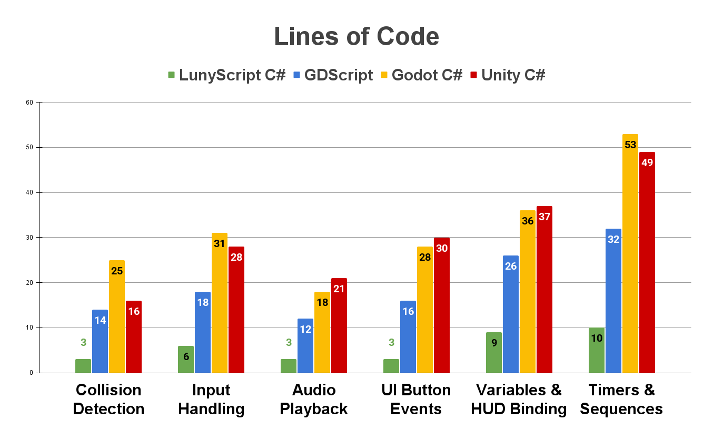

# **LunyScript 🎮** Makes Coding Games Fun!

<iframe width="648" height="365" src="https://www.youtube.com/embed/PfZ4VBui_Wo" frameborder="0" allow="accelerometer; autoplay; clipboard-write; encrypted-media; gyroscope; picture-in-picture" allowfullscreen></iframe>

<sup>Coming soon for **Unity** (Q2/2026) and **Godot** (Q4/2026) ...</sup>

LunyScript is the powerful and user-friendly alternative to visual scripting.

## **Game Over For _Tutorial Hell_ !** 🤗

```csharp
public MyPlayer()
{
    When.Collision.With("ball")
        .Begins(Audio.Play("energy_buildup"))
        .Ends(Spawn("sparkles"), Event.Send("kick").To("ball"));
}
```

---

## **✨ Same Code - Any Engine ✨** 

LunyScript is the beginner-friendly, high-level gameplay programming API. It works **uniformly across C# game engines** with built-in Statemachines and Behaviour Trees.

Something missing? Extend its bite-sized blocks by writing C# extension methods. Learn the engine as you go. Build your own functional, reusable, portable code library.

---

## **🤨 Any Engine?? Das Crazy! 🤯** 

Game engines all share the same fundamental features needed to create a [_Megabonk_](https://store.steampowered.com/app/3405340/Megabonk/){:target="_blank"}. Here's the proof: three engines, same code, made in 20 days.

[](PoC_2025-10/)

🚧 **Status: Proof of Concept** 🚧<br/>
📸 → [**View detailed PoC documentation, screenshots, and source code**](PoC_2025-10/)

---

# **🥴 LunyScript Cures Cognitive Overwhelm 💊**

LunyScript is 3-5 times less verbose than GDScript! See **→ [Code Comparison](docs/CodeComparison.md)**

[](docs/CodeComparison)

---

# **But .. Why?**

I **know** that the amalgamation of **design as code** works and provides huge benefits to all creative thinkers and tinkerers. 
I can't expect you to trust my judgement, but it requires a few more words. **→ [The Problem Statement](docs/ProblemStatement)**

---

# **Who This Is For**

**🎓 Self-Learners & Hobbyists**<br/>Easier than Roblox scripting. Publish anywhere. [Learn more →](docs/TargetAudience.md#-self-learners--hobbyists-primary-audience)

**📹 Learnfluencers**<br/>Pit engines head-to-head. Expand your audience. [Learn more →](docs/TargetAudience.md#-learnfluencers-online-tutors-high-impact-multipliers)

**🎨 Visual Scripters**<br/>Tired of dragging noodly nodes? Design as code! [Learn more →](docs/TargetAudience.md#-visual-scripters-early-adopters)

**🏫 Educators**<br/>One curriculum, many engines. Teach concepts, not semantics. [Learn more →](docs/TargetAudience.md#-formal-educators--institutions)

**🎮 Prototypers**<br/>Jam fast and still write reusable code. [Learn more →](docs/TargetAudience.md#-prototypers--game-jammers)

**🔧 Framework Developers**<br/>Code for mankind, not "your" engine. [Learn more →](docs/TargetAudience.md#-framework--tool-developers)

---

# **Roadmap**

- **Phase 1:** **Unity** (C#)<br/>API Design; Portable Layer; Demos & Docs (Q2 2026)
- **Phase 2:** **Godot** (C#)<br/>Cross-Engine Tests; Improve Onboarding (Q4 2026)
- **Phase 3:** **Lua (Unity, Godot)**<br/>Bindings Generator; Stabilize API; More Engines PoC (Q2 2027)

**→ [Maintenance strategy](MAINTENANCE.md)**

---

# **Join the Discussion!**

**Share your thoughts, ask questions, propose ideas!**

[💬 Join the Discussions](https://github.com/CodeSmile-0000011110110111/LunyScript-RFC/discussions/){:target="_blank"} • [📖 Design](https://codesmile-0000011110110111.github.io/LunyScript-RFC/docs/) • [❓ FAQ](FAQ.md)

Help shape the future of cross-engine, uniform game programming!

<iframe src="https://ghbtns.com/github-btn.html?user=CodeSmile-0000011110110111&repo=LunyScript-RFC&type=star&count=true" frameborder="0" scrolling="1" width="72" height="22"></iframe>
<font size=6>👈️👍️</font>
Please **star** the [LunyScript-RFC GitHub repository](https://github.com/CodeSmile-0000011110110111/LunyScript-RFC){:target="_blank"} to show your support!

---

##### **AI Usage Info**

<sub>Since LunyScript is an open source project, certain rules regarding AI usage needed to be established. You can find them here:
**→ [FOSS-compliant AI-assisted development](AI-USAGE.md)**</sub>
